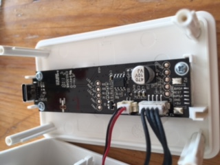
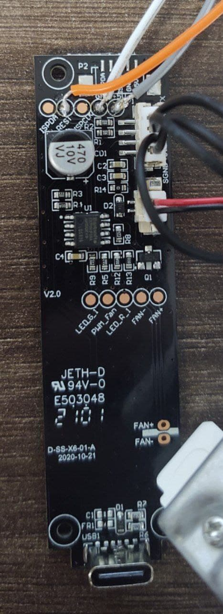

<h2>Modyfikacja  Ikea VINDRIKTNING w SUPLA </h2>

To repozytorium przedstawia sposob modyfikacji czujnnika jakości powietrza pochodzącego z sieci sklepów IKEA o oznaczeniu  VINDRIKTNING PM2.5 
Modyfikacja w żaden sposób nie zakłóca normalnej pracy urządzenia. ESP8266 po prostu dodaje kolejny zlew danych obok kolorowych diod LED.

Modyfikacja wzorowana na projekcie https://github.com/Hypfer/esp8266-vindriktning-particle-sensor oraz na firmware GUI_Generic 
autorstwa   @krycha88 i @Espablo z https://forum.supla.org

## Wstęp

Aby rozszerzyć czujnik jakości powietrza, będziesz potrzebować

ESP8266 z regulatorem napięcia 5V (np. Wemos D1 Mini),

opcjoanalnie czujnik bme280 / sht3x , bh1750

Kilka krótkich kablków

Lutownica

Długi śrubokręt PH0 (np. Wera 118022)

Na szczęście w obudowie jest sporo niewykorzystanego miejsca, co jest idealne dla naszego ESP8266.

Ponadto wszystko, czego potrzebujemy, jest dostępne za pośrednictwem łatwych do lutowania punktów testowych.

## Sprzęt

Aby zainstalować ESP8266, należy odkręcić cztery widoczne śruby z tyłu obudowy.

Są też trzy śruby mocujące maleńką płytkę drukowaną na miejscu. Nie trzeba ich usuwać, ponieważ można lutować na miejscu, 

jednak osobiście radzę wyjąć płytkę z tego miejsca, ponieważ będzie łatwiej lutować bez obawy przypadkowego stopienia plastiku.

Jak widać na tym obrazku, będziesz musiał przylutować tylko przewody do GND, 5V i punktu testowego, który jest podłączony do TX czujnika cząstek.

Następnie podłącz te przewody do GND, VIN (5 V) i GPIO2-D4 (jeśli używasz Wemos D1 Mini).

VINDRIKTNING składa się z niestandardowego (?) Cubic PM1006-podobnego czujnika + innego uC, który obsługuje wszystkie te diody LED, 

które rozmawiają przez UART. UC po prostu regularnie odpytuje czujnik i wyświetla wyniki.

Dlatego, aby dodać łączność Wi-Fi, wystarczy odsłuchać TX czujnika i odszyfrować te wiadomości. Ikea uC zrobi to za nas.

Przejścia z zielonego na żółty i żółty na czerwony w oprogramowaniu Ikea wynoszą około 30 i 100 μg/m³.

Gotowe.

## Opogramowanie

Oprogramowanie układowe można zbudować i flashować za pomocą Arduino IDE.

W tym celu musisz dodać do niego obsługę ESP8266 za pomocą Menedżera tablic .

Ponadto będziesz musiał również zainstalować następujące biblioteki za pomocą Menedżera bibliotek:

SuplaDevice oraz dodatkowe pliki znajdujące sie w folderze lib 

Podczas konfiguracji urzadzenia możliwe jest dodanie czujnika ds18b20 , bme280 lub sht3x a nawet bh1750

przez co zwiekszymy funkcjonalnośc urzadzenia o dodatkowe funcjie jak pomiar temperatury, wilgotności czy natężenie oświetlenia w pomieszczeniu 

Po prostu zbuduj, sflashuj i gotowe.

